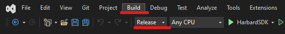
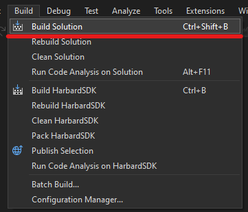
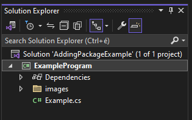
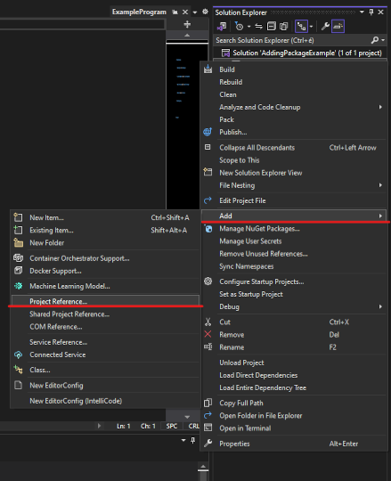
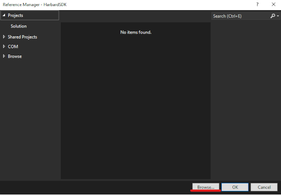
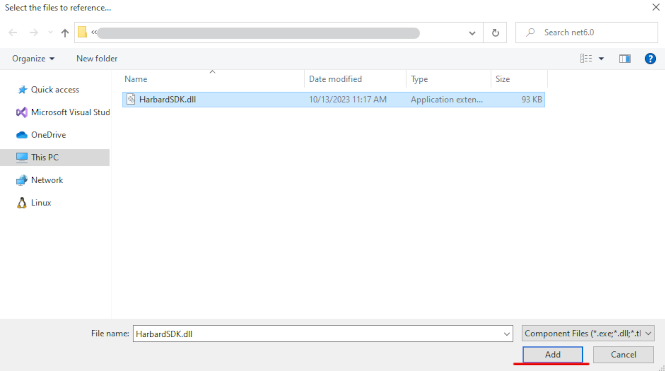
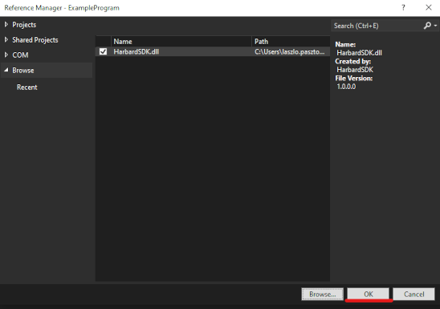
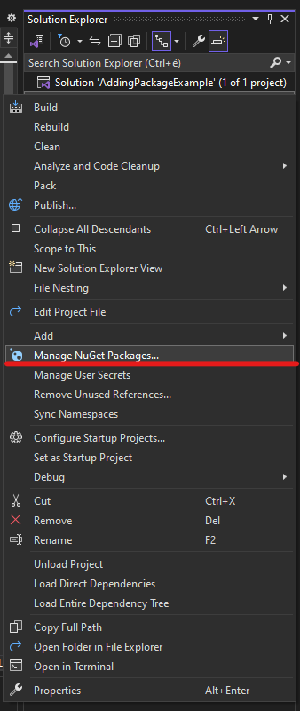
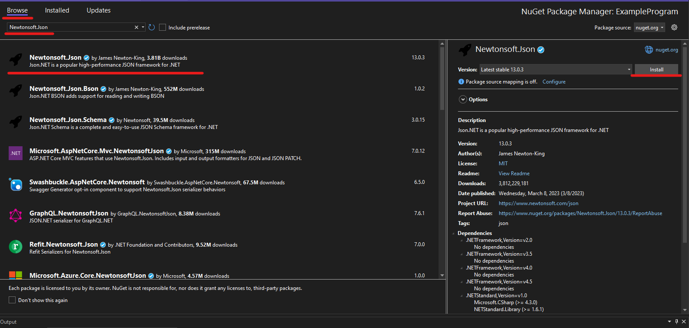

# HarbardSDK

.NET Software Development Kit for integrating your HARBARD API compatible traffic monitoring device into your application.<br/>
Provides high level classes and functions indentical to the ones defined in [Harbard API documentation](Docs/HarbardAPI.pdf).
## Compatible devices
- **Einar-5 from** v2.3.0
- **Einar Gen 2** from v1.3.0
- **Carmen Box/Nano** from v1.4.0
- **Enforce Box/Nano** from v1.4.0
- **MicroCAM** Gen 2 from v1.0.0

## Using SDK
In order to use API functions one must aquire a device session through one of the following classes depending on the level of abstraction required.
> [!NOTE] 
> *The available methods are grouped into categories. Each category has a set of methods that can perform an action on the device or query the device for information.*

> [!IMPORTANT]
> **Requirements: NewtonSoft.Json**

### ApiSession 
*Provides high level API functions divided into categories. Each category is represented by a class member.*
- Function names in each category are indentical to the ones defined in [Harbard API documentation](Docs/HarbardAPI.pdf).
- Every function has a **synchronous** and **asynchronous** version.
- For each request and response structure related to an API method there is a matching C# class.

| Members | Description |
|-----|-----------|
| **SystemSession** | Methods that allow configuring general aspects of the device like name, time or user accounts |
| **AnalyticsSession** | Methods for managing analytics engines, detectors and querying events |
| **StorageSession** | Methods for managing the on-board storage and querying stored data |

### Session
*Providies low level functions to execute API methods*
- Request and response structures are represented by NewtonSoft JSON objects (JObjects).

| Functions | Description |
|-----|-----------|
| **executeCommand**(category, method, data?) | Executes an API method in a given category<br> data is expected JObject (for further details see [Harbard API documentation](Docs/HarbardAPI.pdf))  |
| **executeCommandAsync**(category, method, callback, data?) | Asynchronous version of executeCommand that expects a `callback` |
| **login**() | Provides SessionID for API calls in case of a successful login<br> Must be called before calling *executeCommand* |
| **logout**() | Releases previously acquired SessionID |

### Examples
***Aquire API session*** - *Creating ApiSession with `using` statement takes care of login and logout*
```c#
string address = "<ip>|<hostname>";
string username = "<device user>";
string password = "<device password>";

using(var apiSession = new ApiSession(address, username, password, /*port = 80, secureConnection = false*/))
{
    if(apiSession) //login succeeded, apiSession is valid, contains apiSession.Session.Id
    {
        //your code here
    }
    else if(apiSession.Session.LastError != null) //LastError check is for avoiding compile warning only
    {
        //throw session.Session.LastError; OR
        Console.Error.WriteLine(apiSession.Session.LastError.exceptionClass + " : " + apiSession.Session.LastError.errorMessage);
    }
}
```
### Events
Devices support multiple modes for acquiring emitted events.<br>
Event fetching can either be **live** or **from device strorage**.

**Live event stream**<br>
- Contains *event image* and *metadata*
- HTTP multipart stream
- **LiveEventStream** class implements recieving events from *live event stream*.

```c#
using(var apiSession = new ApiSession(address, username, password, /*port = 80, secureConnection = false*/))
{
    if(apiSession) //login succeeded, apiSession is valid, contains apiSession.Session.Id
    {
        using(LiveEventStream liveEventStream = new LiveEventStream(apiSession.Session, event_callback))
        {
            liveEventStream.Run(); //blocks until connection is closed or returning false from event callback
        }
    }
    else if(apiSession.Session.LastError != null) //LastError check is for avoiding compile warning only
    {
        //throw session.Session.LastError; OR
        Console.Error.WriteLine(apiSession.Session.LastError.exceptionClass + " : " + apiSession.Session.LastError.errorMessage);
    }
}
```

Creating an **event callback**:<br>
> [!NOTE] 
> *Running code in event_callback will not affect the flow of event stream*

```c#
private static bool event_callback(EventPackage event_package)
{
    //If no events occure for a certain time a keepalive message will be sent by the device
    if (event_package.isKeepAlive)
    {
        //your code here
        //It is a good place to decide to continue reading events or to stop.
        return true; //we decided to continue reading events
    }

    //Check for event image
    if ((event_package.image != null) && (event_package.image.data != null))
    {
        //your code here
        //event_package.image.data contains the event image binary
        //event_package.image.width, event_package.image.height holds the event image's dimensions
        //event_package.image.format holds the event image format
        File.WriteAllBytes("./" + event_package.image.imageId + "." + event_package.image.format, event_package.image.data);//we chose to save image to disc
    }

    //Check for event metadata
    if (event_package.eventInfo != null)
    {
        //We chose to print detector name : event ID : event time
        Console.WriteLine($"{event_package.eventInfo._Config._DisplayName} : {event_package.eventInfo._EventID} : {event_package.eventInfo._EventTime}");

        //your code here
        //event_package.eventInfo is an object of Event class that provides several event specializations
        //<EventType>? current_event = event_package.eventInfo.as<EventType>();

        //we chose to check if it is an ANPR type event and write some info to console
        EventANPR? anprEvent = event_package.eventInfo.asEventANPR();
        if(anprEvent != null) //this is an ANPR event
        {
            if(anprEvent._EventInfo != null) //check is for avoiding compile warning only
            {
                var event_info = anprEvent._EventInfo;
                Console.WriteLine($"LicensePlate: {event_info._Text}, Country: {event_info._Country}");
            }
        }
        else
        {
            //check for other event types
        }
    }
    return true;
}
```
Start LiveEventStream asynchronously
> [!WARNING] 
> *Avoid `using` statements in case of running LiveEventStream asynchronously*
```c#
ApiSession apiSession = new ApiSession(address, username, password, /*port = 80, secureConnection = false*/);
LiveEventStream? liveEventStream = null;
if(apiSession)
{
    LiveEventStream liveEventStream = new LiveEventStream(apiSession.Session, event_callback);
    liveEventStream.RunAsync((Exception e)=>
    {
        Console.WriteLine("Thread exception: {0}", e);
    });
}
//... code ...
apiSession.Dispose(); // apiSession.Dispose must be called explicitly
```
<br>

**Live event query**<br>
- Contains *metadata* only
- Based on polling events, makes multiple HTTP requests
- HTTPS support
- **LiveEventQuery** class implements polling events from *live event query*.

```c#
using(var apiSession = new Harbard.ApiSession(ip, username, password, port, false))
{
    if(apiSession)
    {    
        LiveEventQuery liveEventQuery = new LiveEventQuery(apiSession.Analytics, anprCallback);
        liveEventQuery.Run(); //blocks until session/connection is closed or returning false from event callback
    }
    else
    {
        if(session.Session.LastError != null)
        { Console.Error.WriteLine(apiSession.Session.LastError.exceptionClass + " : " + apiSession.Session.LastError.errorMessage); }
    }
}
```
Creating an **event callback**:<br>
```c#
    private static bool event_callback(BufferedEvents? buffered_events, ApiException? api_error)
    {
        if (api_error != null)
        {
            //some error occured
            Console.WriteLine(api_error.ToString());
            return false;//stop receiving
        }
        else if (buffered_events != null)
        {
            //Printing number of events discarded since the start of buffering
            //See in Harbard API documentation
            Console.WriteLine($"Discarded events count: {buffered_events._DiscardedEvents}");

            foreach (var analyticsEvent in buffered_events._EventList)
            {
                //We chose to print detector name : event ID : event time
                Console.WriteLine($"{analyticsEvent._Config._DisplayName} : {analyticsEvent._EventID} : {analyticsEvent._EventTime}");

                //analyticsEvent is an object of Event class that provides several event specializations
                //<EventType>? current_event = event_package.eventInfo.as<EventType>();

                //we chose to check if it is an ANPR type event and write some info to console
                EventANPR? anprEvent = analyticsEvent.asEventANPR();
                if (anprEvent != null) //this is an ANPR event
                {
                    if (anprEvent._EventInfo != null) //check is for avoiding compile warning only
                    {
                        var event_info = anprEvent._EventInfo;
                        Console.WriteLine($"LicensePlate: {event_info._Text}, Country: {event_info._Country}");
                    }
                }
                else
                {
                    //check for other event types
                }
            }
        }
        return true;
    }
```
<br>


**Stored event query**<br>
- Contains *event image*, *event video* and *metadata*
- Requires storage device
- **StoredEventQuery** class implements recieving a list of events from stored event query

```c#
using (var apiSession = new ApiSession(address, username, password, /*port = 80*/))
{
    if (apiSession) //login succeeded, apiSession is valid, contains apiSession.Session.Id
    {
        StoredEventQuery storedEventQuery = new StoredEventQuery(apiSession.Storage, startTime, endTime);

        StorageEvents storageEvents = storedEventQuery.Run(); //runs once and returns with a list of events recorded in the given timeframe

        if(storageEvents._EventList != null) //check is for avoiding compile warning only
        {
            foreach (var storageEvent in storageEvents._EventList)
            {
                //We chose to print detector name : event ID : event time
                Console.WriteLine($"{storageEvent._Config._DisplayName} : {storageEvent._EventID} : {storageEvent._EventTime}");

                //Fetching relevant EventImage by calling the GetEventImage function:
                var image = storedEventQuery.GetEventImage(storageEvent);

                //your code here

                //we chose to save image to disk:
                if ((image != null) && (image.data != null)) //check is for avoiding compile warning only
                { File.WriteAllBytes("./" + storageEvent._EventID + "." + image.format, image.data); }

                //Fetching relevant EventVideo by calling the GetEventVideo function:
                var video = storedEventQuery.GetEventVideo(storageEvent);

                //your code here

                //we chose to save video to disk
                if ((video != null) && (video.data != null)) //check is for avoiding compile warning only
                { File.WriteAllBytes("./" + storageEvent._EventID + "." + video.format, video.data); }
            }
        }
    }
    else if (apiSession.Session.LastError != null) //LastError check is for avoiding compile warning only
    {
        //throw session.Session.LastError; OR
        Console.Error.WriteLine(apiSession.Session.LastError.exceptionClass + " : " + apiSession.Session.LastError.errorMessage);
    }
}
```

## **Compiling SDK** in VisualStudio 2022
> [!IMPORTANT]
> You need to compile the **HarbardSDK** before using it

1. Open ***HarbardSDK.csproj*** file and set configuration to *Release*. Then click on *Build*<br>

1. Then click on *Build Solution*<br>


This will create a *dll* file in the *bin/Release* by default.<br>
You can use this *dll* file to `Add HarbardSDK to your solution`.

## Compiling examples

Before being able to run the example programs you need to compile them with the same method used when `Compiling the SDK`.<br>

1. Open *your chosen example program's .csproj* file and set configuration to *Release*. Then click on *Build*<br>

1. Then click on *Build Solution*<br>


Now you are ready to run the example programs.

## **Adding HarbardSDK to a solution** in VisualStudio 2022
**Follow this quick guide to learn how to add HarbadSDK to your solution:**<br>

> [!IMPORTANT] 
> Adding **HarbardSDK** to a solution is only possible if it the **SDK** has already been compiled.<br>
> **See `Compiling SDK` for more**

1. In VisualStudio 2022, go to the Solution Explorer and right-click on your *csproject* file<br>

1. Then go to `Add` -> `Project Reference`<br>

1. If you do not see the required *dll* file in the *Reference Manager* click on `Browse...`<br>

1. Find your **HarbardSDK.dll** file, select it and click `Add`<br>

1. After the **HarbardSDK.dll** file has been added to the *Reference Manager* click on `OK`<br>


## Adding dependencies to a solution in VisualStudio 2022
### NewtonSoft JSON

> [!IMPORTANT] 
> Adding ***NewtonSoft JSON*** to a solution is necessary for the **HarbardSDK** to work!
> 
**Follow this quick guide to learn how to add NewtonSoft JSON to your solution:**<br>
1. In VisualStudio 2022, go to the Solution Explorer and right-click on your *csproject* file<br>

2. Then click on `Manage NuGet Packages...`<br>

3. In the *NuGet Package Manager* search for ***Newtonsoft.Json*** under the *Browse* tab. Then click *Install*
